# 🚀 Oracle Upgrade Lab: 19c → 23c (Oracle AI Database)

## 📌 Overview
Hands-on upgrade using AutoUpgrade in a local lab.

## 🧪 Environment
- Oracle Linux 8.10
- 4GB RAM
- CDB + PDB

---

## 📸 Upgrade Steps (Real Screenshots)

### Analyze Phase
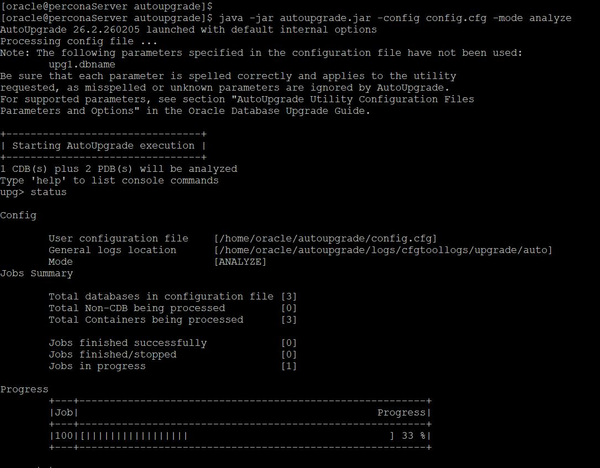
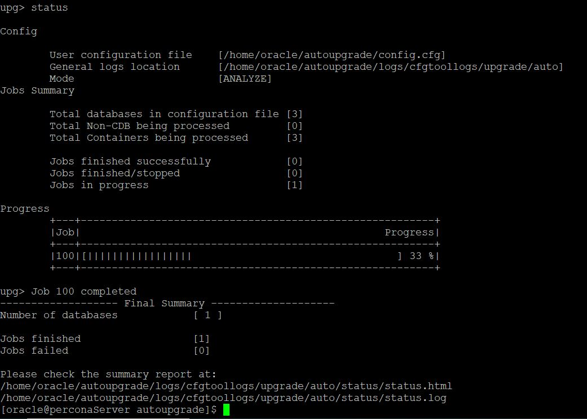

### Fix FRA / Archivelog
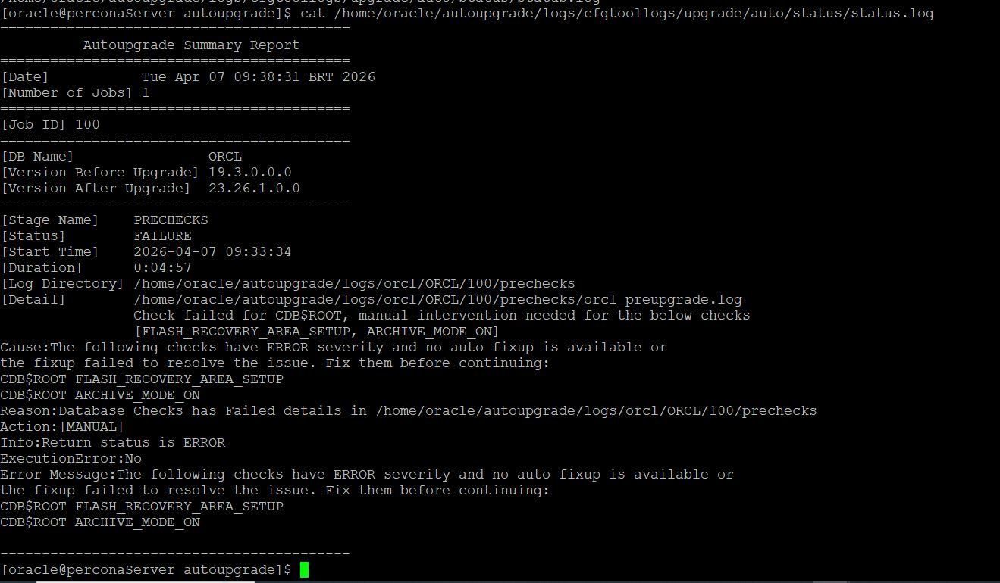
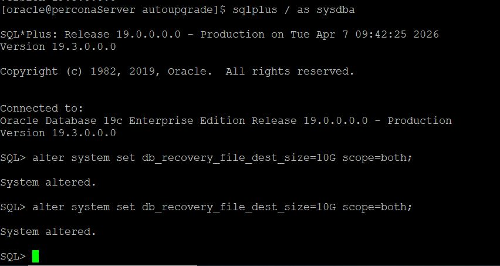

### Deploy (Upgrade Running)
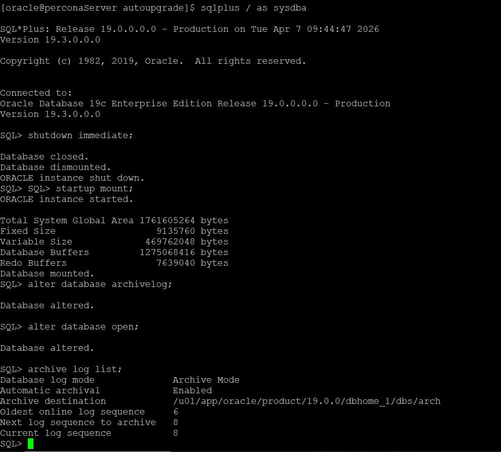
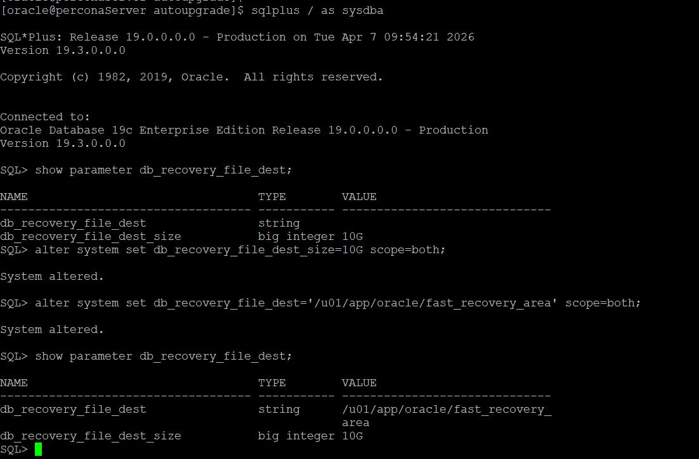
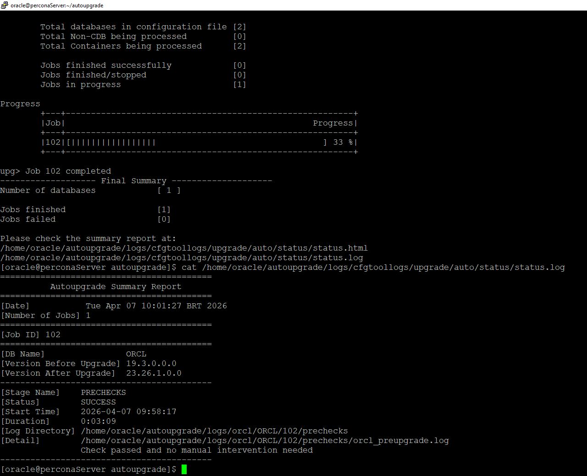

### Monitoring Progress
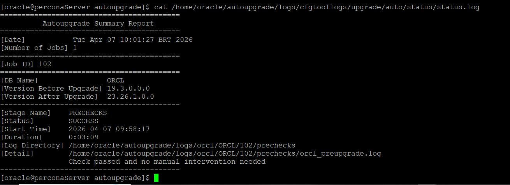
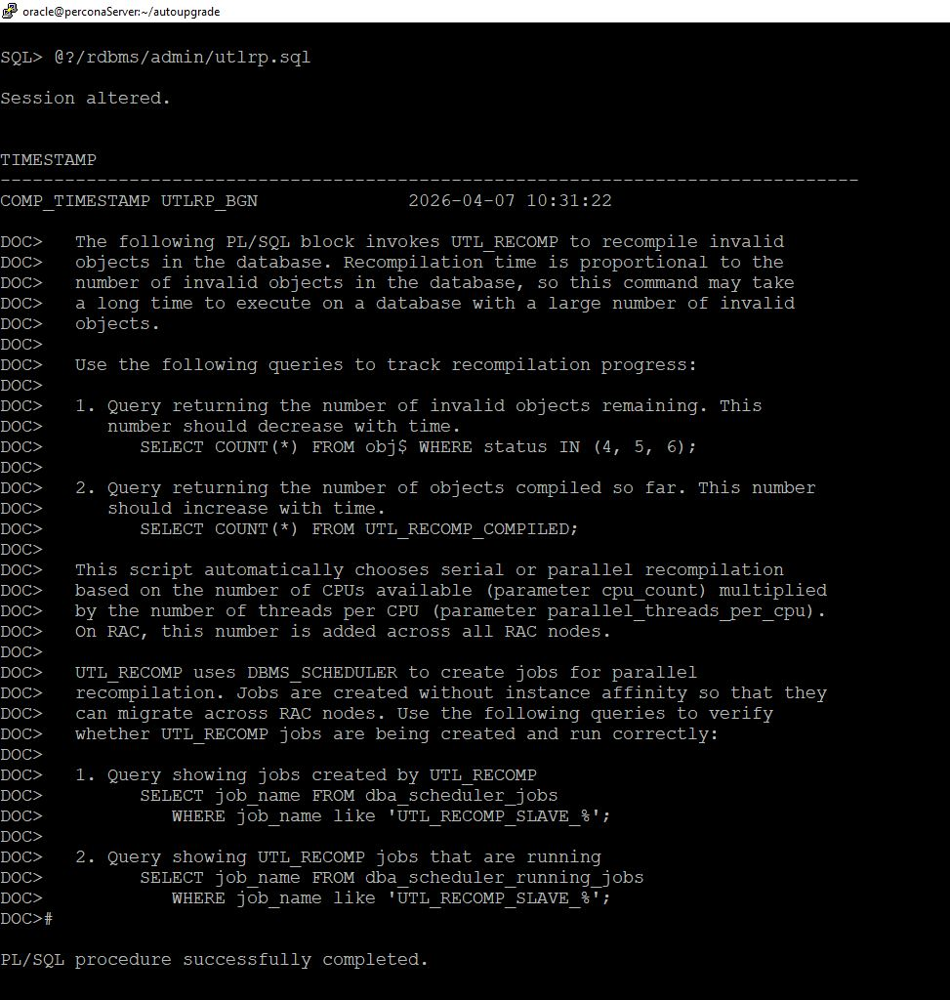

### Final Result
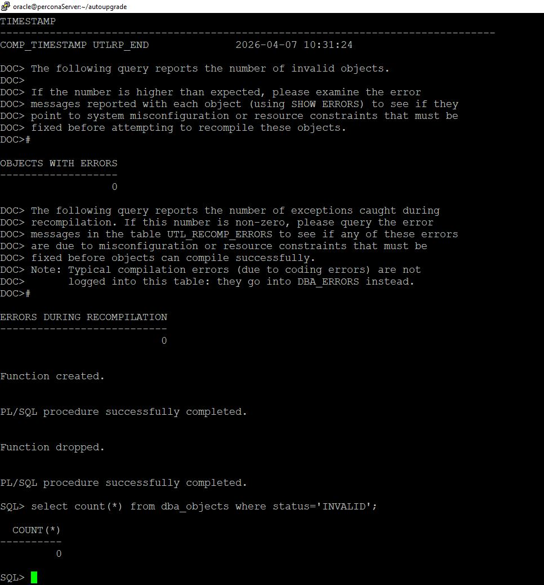
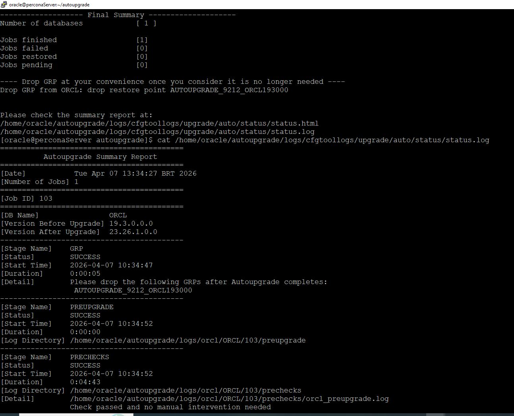
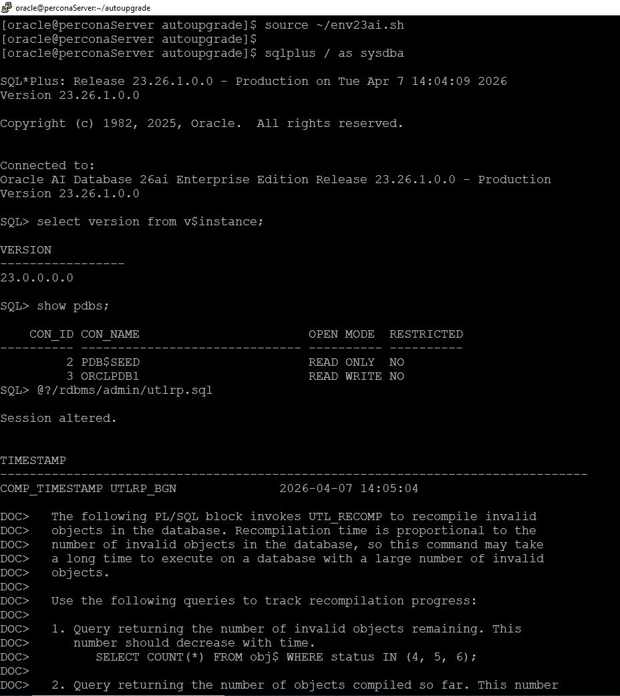

---

## 🚀 Commands

### Analyze
```
java -jar autoupgrade.jar -config config.cfg -mode analyze
```

### Deploy
```
java -jar autoupgrade.jar -config config.cfg -mode deploy
```

---

## 🏆 Result
Oracle Database 23c (AI Database)

---

Author: Marcio Costa
